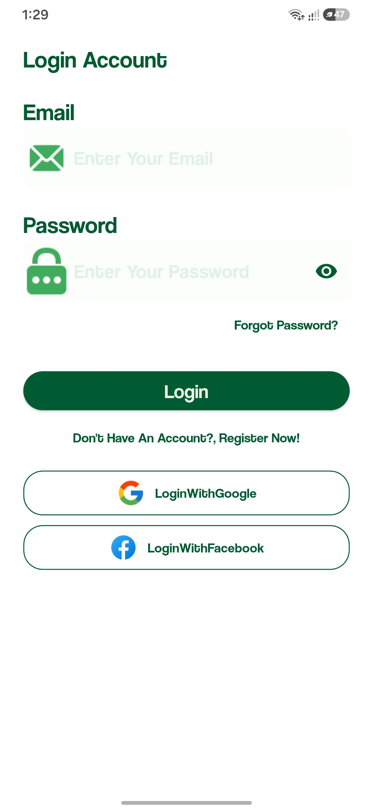
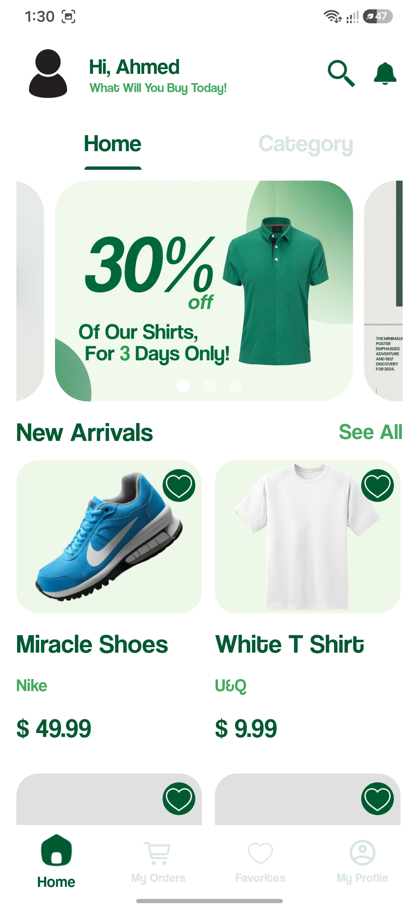
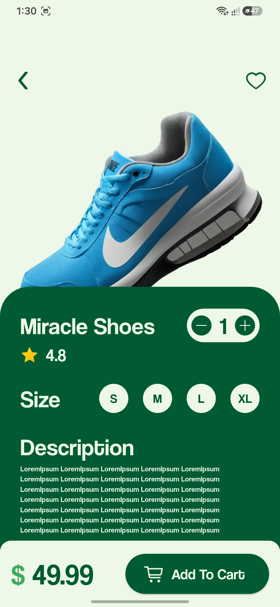
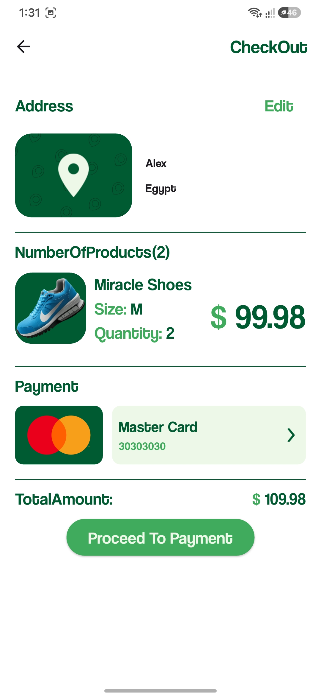

# QuickMart 🛍️

A full-featured e-commerce mobile app built with Flutter, using the BLoC (Business Logic Component) pattern for state management.

This was my first project implementing BLoC architecture, built to deepen my understanding of separating business logic from UI in Flutter.

## Features

- **Authentication**: Email/password login & signup, plus Google and Facebook sign-in
- **Home & Categories**: Browse products by category (Clothes, Shoes, Bags, Hats), promotional banners
- **Product Details**: Size selection, quantity control, ratings, favorites
- **Cart Management**: Real-time quantity and subtotal updates
- **Checkout Flow**: Address selection, saved payment methods, add new card, order summary
- **Firebase Integration**: Backend for auth and data

## Tech Stack

- Flutter / Dart
- BLoC (flutter_bloc) for state management
- Firebase (Auth, Firestore)

## Screenshots

| Login | Home | Product Detail | Checkout |
|-------|------|-----------------|----------|
|  |  |  |  |

## What I Learned

Implementing BLoC for the first time taught me how to manage state across multiple screens cleanly — for example, syncing cart quantity updates between the product detail screen, cart, and checkout in real time, without tightly coupling logic to widgets.
